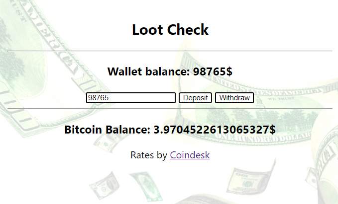

<!-- prettier-ignore -->
<h1 align="center">
  Loot Check
   
    TDD with React - Bitcoin Wallet
</h1>

  <a href="#-tech-stack">Tech Stack</a>

 

 

## 💻 The Project

Playing around with TDD and React.js

 

## 🚀 Tech Stack

| Testing Lib's                      | Front End      | API's |
| -------------                      | ---------------| ----- |
| [Mocha.js](https://mochajs.org/)   | [React.js](https://reactjs.org) | [Coindesk](coindesk.com/price/bitcoin)|
| [Chai.js](https://www.chaijs.com/) | [Redux](https://redux.js.org/)||
| [Sinon.js](https://sinonjs.org/)   | [Redux Thunk](https://github-images.com/reduxjs/redux-thunk)||
| [Enzyme.js](https://enzymejs.github.io/enzyme/) 
| [chai-jest-snapshot](https://www.npmjs.com/package/chai-jest-snapshot)
| [fetch-mock](http://www.wheresrhys.co.uk/fetch-mock/) 
| [jsdom](https://github.com/jsdom/jsdom) 
| [jsdom-global](https://www.npmjs.com/package/jsdom-global)
| [redux-mock-store](https://github.com/reduxjs/redux-mock-store)

 

  

